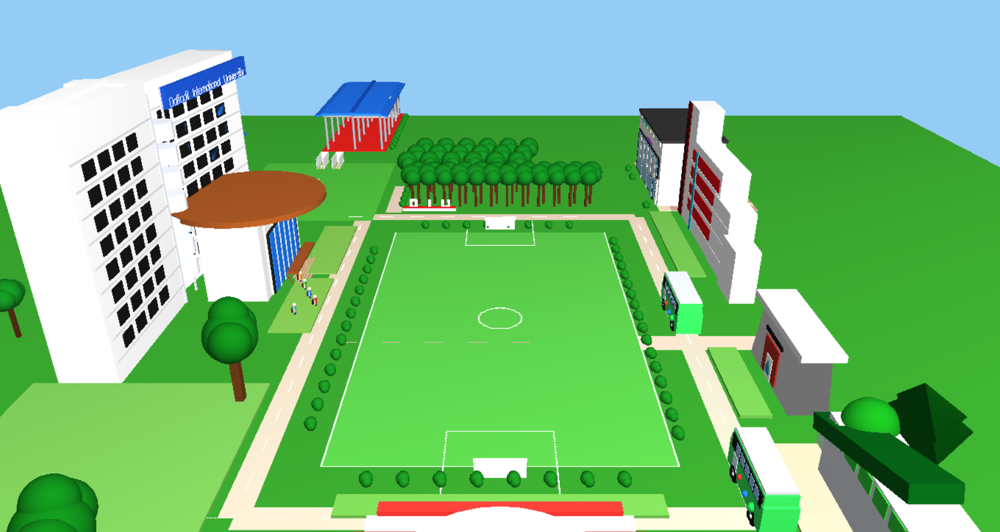
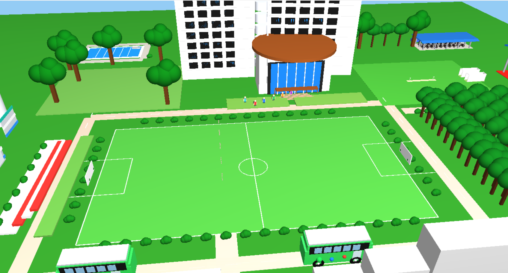
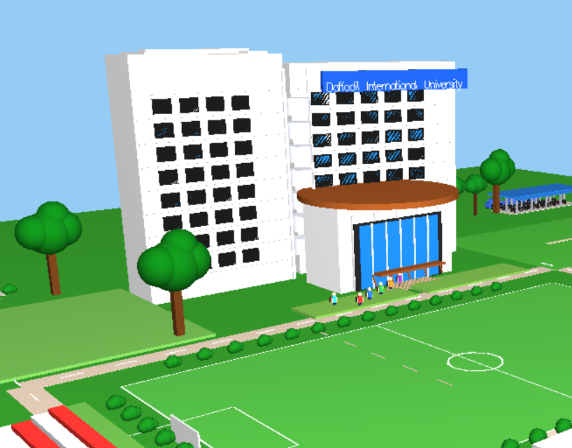

# DIU Smart City


**DIU Smart City** is a 3D computer graphics project developed using **C++**, **OpenGL**, and **GLUT**.
The project simulates a smart city/university campus environment inspired by Daffodil International University, featuring buildings, roads, transportation, and animated objects.

This project demonstrates core computer graphics concepts such as 3D modeling, transformations, animation, lighting, and camera control.


---

## Output Screenshots









---


## Features

* 3D Smart City / Campus Environment
* Realistic Buildings and Infrastructure
* Roads and Transportation System
* Animated DIU Bus Movement
* Walking Student Animation
* Moving Clouds Animation
* Football Field and Cricket Ground
* Trees and Landscape Design
* Multiple Camera Views
* Keyboard Interaction Controls
* Lighting and Depth Effects

---

## Technologies Used

* **Programming Language:** C++
* **Graphics Library:** OpenGL
* **Window Toolkit:** GLUT / FreeGLUT
* **IDE:** Code::Blocks / Visual Studio

---

## How to Run the Project

1. Install **OpenGL** and **GLUT / FreeGLUT** libraries
2. Open the project in Code::Blocks or Visual Studio
3. Compile and run the program

---

## Controls

| Key | Function                        |
| --- | ------------------------------- |
| 0   | Free Orbit View                 |
| 1   | North View                      |
| 2   | South View                      |
| 3   | East View                       |
| 4   | West View                       |
| A   | Rotate camera left (Free View)  |
| D   | Rotate camera right (Free View) |
| W   | Increase camera height          |
| S   | Decrease camera height          |
| Q   | Zoom in                         |
| E   | Zoom out                        |
| ESC | Exit Program                    |

---

## Project Structure

```
DIU-SMART-CITY/
│
├── main.cpp
├── README.md
│
├── output/
│   ├── output1.png
│   ├── output2.png
│   └── output3.png
```


## Demo Video
A complete demonstration of the DIU Smart City project can be viewed here:
(https://drive.google.com/file/d/1ChrRyBLXfwFWnoS4cZSzTzUNLaKBBHF6/view?usp=drive_link)

---

## Learning Objectives

This project demonstrates:

* 3D Object Modeling
* Translation, Rotation, and Scaling
* Animation Techniques
* Lighting and Shading
* Scene Rendering
* Camera Control
* Event Handling in OpenGL

---

## Project Information

**Project Name:** DIU Smart City
**Course:** Computer Graphics
**Language:** C++
**Graphics Library:** OpenGL / GLUT

---

## Author

**Md. Fahim Abdullah**
Department of Computer Science and Engineering
Daffodil International University
